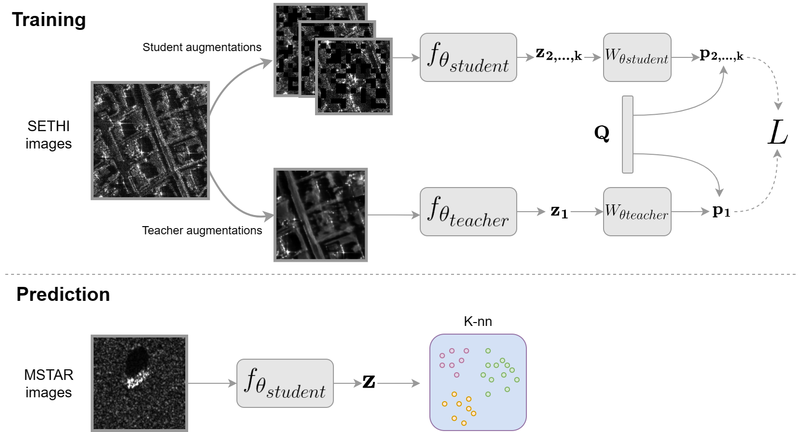

# General Feature Extraction in SAR Target Classification: A Contrastive Learning Approach Across Sensor Types

This the code for the prediction phase related to the paper:
- M. Muzeau, J. Frontera-Pons, C. Ren and J.P. Ovarlez, "General Feature Extraction in SAR Target Classification: A Contrastive Learning Approach Across Sensor Types" 

It consists in the feature extractor explained in the article followed by a k-NN. To apply the algorithm run the `eval_knn.py` file.

## Packages needed
 - Pytorch
 - Numpy
 - sklearn

## Parameters of `eval_knn.py`:

- **nb_knn** : List of all the nearest neighbors computed
- **normalization** : [min,max] parameters to normalise data such that : `y = (log x - min)/(max - min)`
- **eval_path** and **labeled_path** : Path to the data. There must be subfolders in each path. The name of each subfolder will be the class of the data. Both folders should have the same subfolders.
- **arch** : Type of architecture to extract features. For the given model 'vit_tiny' is used. To only unroll the image use None parameter. In this code only the models defined in `pipeline.models.ViT` can be used.
- **patch_size** and **patch_drop** : Size of the ViT convolution for the first layer and percentage of encoded tokens that are masked in the ViT.
- **model_path** : Weights path of the network (if **arch** is not None)
- **pca** and **pca_dim** : Boolean to know if a pca is applied on top of the extracted features. It is supposed to be used on top of the image unroling but it can also be applied on top of the ViT.
- **logger_path** : Path to a logger that will save the accuracy of the method.
 

Copyright 2023@SONDRA

Licensed under the Apache License, Version 2.0 (the "License");

you may not use this file except in compliance with the License.

You may obtain a copy of the License at

[http://www.apache.org/licenses/LICENSE-2.0](http://www.apache.org/licenses/LICENSE-2.0)    

Unless required by applicable law or agreed to in writing, software

distributed under the License is distributed on an "AS IS" BASIS,

WITHOUT WARRANTIES OR CONDITIONS OF ANY KIND, either express or implied.

See the License for the specific language governing permissions and

limitations under the License.

